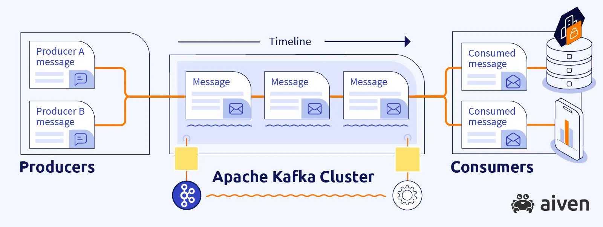
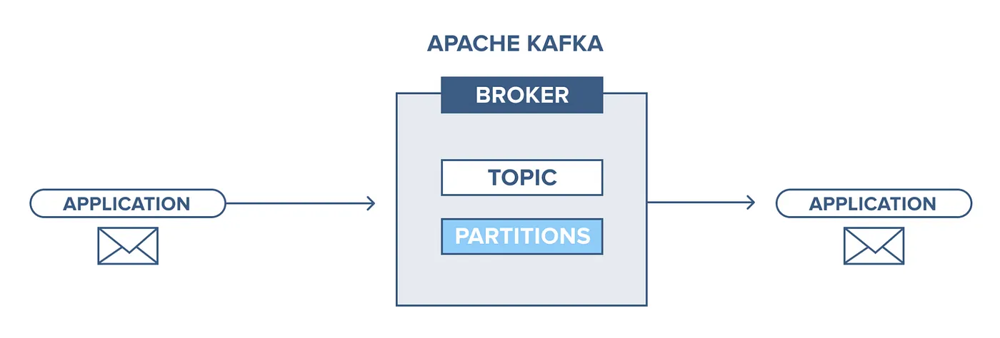

# Apache Kafka

 

https://kafka.apache.org/

Apache Kafka é um OS (Open Source), para stream de dados/mensageria.

* A idéia é sempre que um evento chegar no Kafka (gerado por um **Producer**), ele possa ser transmitido para outros sistemas (chamados **consumidores**);
* Tem alta performance (trilhões de dados todos os dias);
* Alta disponibildiade;
* Pode integrar diversos aplicativos



## How it works

* **Producer**: produz a mensagem para um **Broker**;
* **Broker**: são os mini clusters/servidores que ficam em um **Cluster Kafka**, que possui **Topics/Partitions**
* **Topic**: pode ter 1 ou mais partições - a mensagem cai em um tópico e é armazenada em uma partição
* **Partitions**: é onde fica a mensagem disponível para o consumidor
* **Consumer**: é quem consome a mensagem que estava na partition;




## How to Execute Kafka Locally

https://learn.conduktor.io/kafka/how-to-install-apache-kafka-on-mac/

1. Precisamos baixar o binário do Kafka - https://kafka.apache.org/downloads
   1. Scala 2.13  - [kafka_2.13-3.8.0.tgz](https://downloads.apache.org/kafka/3.8.0/kafka_2.13-3.8.0.tgz) ([asc](https://downloads.apache.org/kafka/3.8.0/kafka_2.13-3.8.0.tgz.asc), [sha512](https://downloads.apache.org/kafka/3.8.0/kafka_2.13-3.8.0.tgz.sha512))
2. Extrair o binário e executar o zookeper

* **ZOOKEPER**: esse cara é responsável por gerenciar os brokers, ie, faz a sincronização caso um broker venha a falhar ficar indisponível.

```shell
kafka_2.13-3.8.0/bin/zookeeper-server-start.sh kafka_2.13-3.8.0/config/zookeeper.properties
```

3. Com o zookeper rodando, iremos executar o kafka

```shell
kafka_2.13-3.8.0/bin/kafka-server-start.sh kafka_2.13-3.8.0/config/server.properties
```


Para verificar se tópicos criados:

```shell
kafka_2.13-3.8.0/bin/kafka-topics.sh --bootstrap-server=localhost:9092 --list
```


## Spring + Kafka

https://spring.io/projects/spring-boot

https://start.spring.io/

Para utilizar KAFKA com Spring, iremos utilizar algumas dependencies:

* **Spring for Apache Kafka**
* **Spring Web**
  * Para a aplicação consumer, não é necessário

```xml
<dependency>
  <groupId>org.springframework.boot</groupId>
  <artifactId>spring-boot-starter-web</artifactId>
</dependency>
<dependency>
  <groupId>org.springframework.kafka</groupId>
  <artifactId>spring-kafka</artifactId>
</dependency>
```


Como teremos **2 projetos (Consumer + Producer)**, iremos configurar a porta que irá rodar cada um localmente, no `application.yml`:

```yaml
server:
  port: 9090

topics:
  payment:
    request:
      topic: "payment.request.topic.v1"

spring.application.name: producer
```

Consumidor:

```yaml
server:
  port: 9080

topics:
  payment:
    request:
      topic: "payment.request.topic.v1"

spring.application.name: consumer
```


### KafkaConfig

Template padrão para o KafkaConfig:

```java
@Configuration
public class ProducerKafkaConfig {

  @Autowired
  private KafkaProperties kafkaProperties;

  @Value("${topicos.pagamento.request.topic}")
  private String pagamentoRequestTopic;

  @Bean
  public ProducerFactory<String, String> producerFactory() {
    Map<String, Object> properties = kafkaProperties.buildProducerProperties();
    return new DefaultKafkaProducerFactory<>(properties);
  }

  @Bean
  public KafkaTemplate<String, String> kafkaTemplate() {
    return new KafkaTemplate<>(producerFactory());
  }

  @Bean
  public NewTopic pagamentoRequestTopicBuilder() {
    return TopicBuilder
        .name(pagamentoRequestTopic)
        .partitions(1)
        .replicas(1)
        .build();
  }
}
```

### ProducerService

Como já configuramos o kafkaTemplate como `@Bean`, basta utilizarmos ele agora no service

```java
@Service
@RequiredArgsConstructor
public class ProducerService {

  @Value("${topics.payment.request.topic}")
  private String topic;
  private final KafkaTemplate<String, String> kafkaTemplate;

  private ObjectMapper objectMapper = new ObjectMapper();

  public String sendToTopic(PagamentoDTO pagamento) throws JsonProcessingException {
    String request = objectMapper.writeValueAsString(pagamento);
    kafkaTemplate.send(topic, request);
    return "Pagamento enviado";
  }
  
}
```

E para consumir esse service:

```java
@Service
@RequiredArgsConstructor
public class PagamentoService {

  private final ProducerService producerService;

  public String create(PagamentoDTO pagamento) {
    try {
      producerService.sendToTopic(pagamento);
      return "Pagamento sent to topic: " + pagamento;
    } catch (JsonProcessingException e) {
      e.printStackTrace();
      return "Error while trying to send Pagamento: " + pagamento;
    }
  }

}
```

Para verificar se tópicos criados:

```shell
kafka_2.13-3.8.0/bin/kafka-topics.sh --bootstrap-server=localhost:9092 --list
```


### ConsumerService

Para consumir a mensagem é mais simples!

* `@kafkaListener` irá receber 2 parâmetros:
  * `topics` -> nome do tópico que foi registrado pelo producer
  * `groupId` -> grupo que irá receber a mensagem (isso influencia caso exsita mais groupIds)

```java
@Component
public class ConsumerService {

  @KafkaListener(topics = "${topics.payment.request.topic}", groupId = "pagamento-request-1")
  public void consumeMessage(String message) {
    System.out.println("Mensagem recebida=========\n" + message);
  }
}
```

